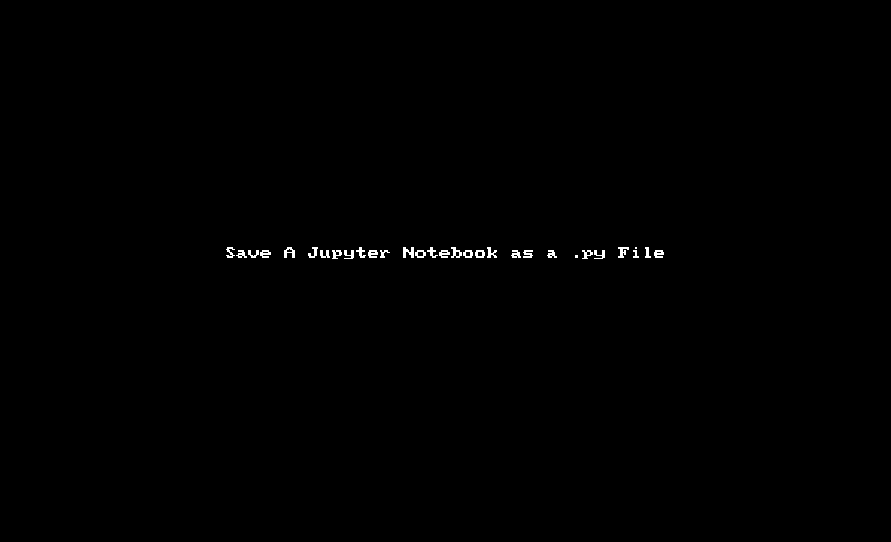

# Earth  Analytics Code Review Activity
All instructions can be completed outside of class if you can’t attend class tomorrow!

## Part 1

* Fork and clone this repo: https://github.com/earthlab-education/ea-2021-ndvi-automation-review 
* Open your NDVI-automation Jupyter Notebook that you submitted for class in Jupyter Notebook. Make sure the notebook starts a [1] and is run all the way through from start to  finish. Export the notebook as a .py file using the file → save as option. Save the file to wherever you cloned your fork of the github repo linked above. *IMPORTANT: Your  name or last name should be in the filename!! Ideally use the naming convention: lastname_firstname_ndvi.py*

## Part 2 

* Submit a PULL REQUEST to the parent repo in earthlab containing two files:
* The Jupyter Notebook that you originally submitted with all plots rendered (run from start to finish)
* The `.py` file that you just created

* Review your partner's pull request
